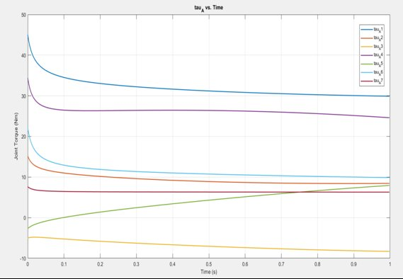
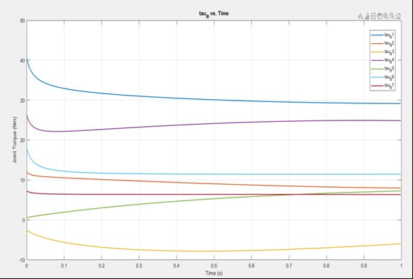
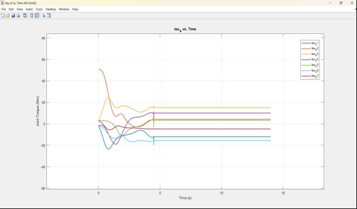
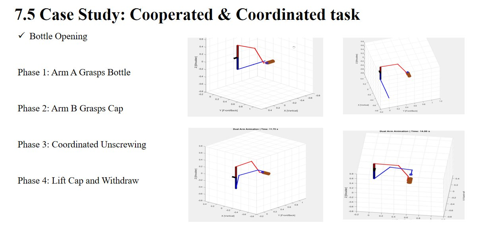
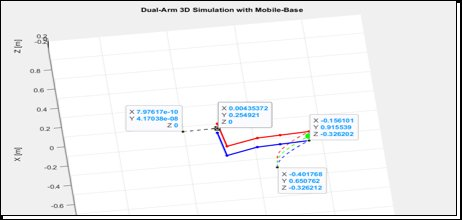

# 🤖 Humanoid Dual-Arm Dynamic Modelling & Simulation
 
<div align="center">
 
[](https://www.mathworks.com/products/matlab.html)
[](https://github.com/ganesh229999/humanoid-14dof-dynamics/blob/master/LICENSE)
[-blue?style=for-the-badge)](#-robot-specification)
[](#-mathematical-foundation)
[](#-simulation-tasks)
<br/>
**A complete MATLAB implementation of Recursive Newton-Euler (RNE) dynamics for a 14-DOF dual-arm humanoid robot — supporting both fixed-base and mobile-base configurations with cooperative object manipulation.**
 
*Developed during a research internship at the Defence Research & Development Organisation (DRDO), India.*
 
</div>
---
 
## 🦾 Robot Architecture
 
```
                        BASE FRAME (Torso / Spine)
                                   │
               ┌───────────────────┴───────────────────┐
               │                                       │
         ARM A (Right)                           ARM B (Left)
               │                                       │
          J1 – Shoulder Flexion / Extension        J1 – Shoulder Flexion / Extension
          │    [Lateral offset: +d₁]               │    [Lateral offset: −d₁]
          │                                        │
          J2 – Shoulder Abduction / Adduction      J2 – Shoulder Abduction / Adduction
          │                                        │
          J3 – Shoulder Internal / External Rot.   J3 – Shoulder Internal / External Rot.
          │    [Upper-arm length: d₂]              │    [Upper-arm length: d₂]
          │                                        │
          J4 – Elbow Flexion / Extension           J4 – Elbow Flexion / Extension
          │                                        │
          J5 – Forearm Pronation / Supination      J5 – Forearm Pronation / Supination
          │    [Forearm length: d₃]                │    [Forearm length: d₃]
          │                                        │
          J6 – Wrist Flexion / Extension           J6 – Wrist Flexion / Extension
          │                                        │
          J7 – Wrist Radial / Ulnar Deviation      J7 – Wrist Radial / Ulnar Deviation
          │    [Wrist offset: d₄]                  │    [Wrist offset: d₄]
          │                                        │
         [EE] Tool Flange                         [EE] Tool Flange
               [Tool offset: d₅]                       [Tool offset: d₅]
               │                                        │
               └───────────────────┬────────────────────┘
                                   │
                          OBJECT / PAYLOAD
                       (Cooperative Manipulation)
```
 
> **14 DOF total** — 7 revolute joints per arm following a human-arm analogy.
> Arm A (right) and Arm B (left) share an identical kinematic structure.
> Only the shoulder lateral offset **d₁** changes sign between arms,
> making the system perfectly symmetric about the torso midplane.
> Gravity acts along the **−X axis** of the base frame (Modified DH convention).
 
---
 
## 📋 Table of Contents
 
- [Overview](#-overview)
- [Key Features](#-key-features)
- [Robot Specification](#-robot-specification)
- [Mathematical Foundation](#-mathematical-foundation)
- [Repository Structure](#-repository-structure)
- [Quick Start](#-quick-start)
- [Module Documentation](#-module-documentation)
- [Simulation Tasks](#-simulation-tasks)
- [Results & Visualisation](#-results--visualisation)
- [Dependencies](#-dependencies)
- [References](#-references)
- [Academic Context](#-academic-context)
---
 
## 🔬 Overview
 
This repository implements a **complete rigid-body dynamics pipeline** for a 14-degree-of-freedom (DOF) dual-arm humanoid robot. The system models both arms (7 DOF each) operating cooperatively to manipulate objects, with full support for:
 
- **Fixed-base** operation (robot mounted on stationary platform)
- **Mobile-base** operation (robot on a moving ground vehicle)
- **Cooperative manipulation** (both arms jointly handling an object)
- **External force handling** (via partial Jacobian mapping)
- **Real-time 3D animation** with end-effector trajectory tracing
The core algorithm — **Recursive Newton-Euler (RNE)** — achieves O(n) computational complexity versus the O(n³) Lagrangian formulation, making it suitable for real-time control at 1 kHz update rates.
 
---
 
## ✨ Key Features
 
| Feature | Description |
|---------|-------------|
| 🔁 **RNE Dynamics** | Forward + backward recursion computing τ = M(q)q̈ + C(q,q̇)q̇ + G(q) |
| 🦾 **Dual-Arm** | Symmetric 7-DOF arms (A=right, B=left), differentiated by shoulder offset sign |
| 🚗 **Mobile Base** | Khalil-Dombre coupling solves platform acceleration from arm dynamics |
| 📐 **Full DH Chain** | Modified DH convention, 8 transforms per arm (7 joints + EE) |
| 🎯 **DLS Inverse Kinematics** | Damped Least-Squares IK for smooth, singularity-robust trajectories |
| 🧮 **Matrix Decomposition** | Inertia M, Coriolis C, Gravity G computed and exported separately |
| 🌐 **External Forces** | Wrench inputs mapped to joint torques via partial Jacobian |
| 🎬 **3D Animation** | Real-time visualisation with world-frame FK, base motion, EE traces |
| 📊 **Excel Export** | All trajectories and torques exported to structured `.xlsx` files |
| 🍾 **Multi-Task** | Validated on upward lifting AND bottle-opening manipulation scenarios |
 
---
 
## 🤖 Robot Specification
 
### Kinematic Structure
 
Each arm follows a **7-DOF anthropomorphic configuration** modelled after human arm kinematics:
 
```
Joint   Anatomy                        Axis    DH Parameter
──────────────────────────────────────────────────────────────
  J1    Shoulder Flexion/Extension      Z       d₁  (±, differentiates A/B)
  J2    Shoulder Abduction/Adduction    Z       —
  J3    Shoulder Internal/External Rot  Z       d₂  (upper-arm offset)
  J4    Elbow Flexion/Extension         Z       —
  J5    Forearm Pronation/Supination    Z       d₃  (forearm offset)
  J6    Wrist Flexion/Extension         Z       —
  J7    Wrist Radial/Ulnar Deviation    Z       d₄  (wrist offset)
  EE    Tool Flange (fixed)             —       d₅  (tool offset)
```
 
### DH Parameter Table (Both Arms)
 
| Row | α (rad) | a (m) | θ_offset (rad) | d |
|-----|---------|-------|----------------|---|
| J1 | 0 | 0 | π | ±d₁ |
| J2 | −π/2 | 0 | −π/2 | 0 |
| J3 | π/2 | 0 | −π/2 | d₂ |
| J4 | −π/2 | 0 | 0 | 0 |
| J5 | π/2 | 0 | 0 | d₃ |
| J6 | −π/2 | 0 | 0 | 0 |
| J7 | π/2 | 0 | 0 | d₄ |
| EE | 0 | 0 | 0 | d₅ |
 
> Specific link lengths and offsets are proprietary to the robot platform
> used during the DRDO research internship and are not disclosed.
 
### Dynamic Parameters
 
| Link | Description | Mass range | Primary inertia axis |
|------|-------------|-----------|----------------------|
| 1 | Shoulder assembly | Heavy | I_zz dominant |
| 2 | Shoulder rotation | Medium | I_xx dominant |
| 3 | Upper arm | Medium | I_zz dominant |
| 4 | Elbow assembly | Medium | I_zz dominant |
| 5 | Forearm | Light-Medium | I_xx, I_zz coupled |
| 6 | Wrist assembly | Light | All components present |
| 7 | Hand + tool | Heaviest link | Large I_xx, I_yy |
 
> **Note:** Exact mass, COM position, and inertia tensor values are derived
> from CAD mass-property analysis of the robot platform and are proprietary.
> The code uses representative values that preserve the correct dynamic structure.
> Total arm mass is in the range typical of collaborative robot arms (~10–14 kg per arm).
 
---
 
## 📐 Mathematical Foundation
 
### 1. Recursive Newton-Euler Algorithm
 
The RNE algorithm computes joint torques in **O(n)** operations using two recursive passes:
 
#### Forward Pass — Velocity & Acceleration Propagation
 
```
ωᵢ₊₁  = Rᵢᵀ (ωᵢ + ẑ·θ̇ᵢ)
ω̇ᵢ₊₁  = Rᵢᵀ (ω̇ᵢ + ωᵢ × ẑ·θ̇ᵢ + ẑ·θ̈ᵢ)
v̇ᵢ₊₁  = Rᵢᵀ (v̇ᵢ + ω̇ᵢ × pᵢ + ωᵢ × (ωᵢ × pᵢ))
 
COM acceleration:
v̇cᵢ = v̇ᵢ₊₁ + ω̇ᵢ₊₁ × rcᵢ + ωᵢ₊₁ × (ωᵢ₊₁ × rcᵢ)
```
 
#### Backward Pass — Force & Torque Propagation
 
```
fᵢ  = Rᵢ₊₁ fᵢ₊₁ + mᵢ v̇cᵢ
nᵢ  = Rᵢ₊₁ nᵢ₊₁ + Iᵢ ω̇ᵢ₊₁ + ωᵢ₊₁ × (Iᵢ ωᵢ₊₁)
    + rcᵢ × (mᵢ v̇cᵢ) + pᵢ × (Rᵢ₊₁ fᵢ₊₁)
 
Joint torque:  τᵢ = nᵢ · ẑᵢ
```
 
#### Equation of Motion
 
```
τ = M(q)q̈ + C(q,q̇)q̇ + G(q) + τ_ext
```
 
Where:
- **M(q)**: 7×7 configuration-dependent joint-space inertia matrix
- **C(q,q̇)**: Coriolis/centrifugal torque vector
- **G(q)**: Gravity torque vector (RNE with zero velocities/accelerations)
- **τ_ext**: External wrench contribution via partial Jacobian
### 2. Inertia Matrix Extraction
 
M is extracted column-by-column using **unit joint acceleration perturbations**:
 
```matlab
M(:,j) = rne(q, 0, eⱼ) − G(q)     % eⱼ = j-th unit basis vector
```
 
This exploits RNE's linearity in q̈ to recover M in exactly 7 additional RNE calls.
 
### 3. Damped Least-Squares Inverse Kinematics
 
```
q̇ = J†_dls · Jo · Vc_d
 
where  J†_dls = (JᵀJ + λ²I)⁻¹ Jᵀ    (λ = 1×10⁻⁴)
```
 
The damping factor λ prevents velocity blow-up near kinematic singularities
while introducing bounded position error proportional to λ².
 
### 4. Mobile Base — Khalil-Dombre Coupling
 
For a mobile platform, arm and base dynamics are coupled:
 
```
Mbase · ä_base = −[Jrc_A·q̈_A + Jrc_B·q̈_B + βrc]
 
where:
  Mbase = ΣᵢmᵢI₃ + platform inertia      (3×3 effective base inertia)
  Jrc   = [Jrc_A | Jrc_B]                (3×14 reaction Jacobian)
  βrc   = Σⱼ (z₀ⱼ × (z₀ⱼ × v₀)) θ̇ⱼ    (velocity-dependent bias)
```
 
---
 
## 📁 Repository Structure
 
```
humanoid-14dof-dynamics/
│
├── 📄 README.md
├── 📄 LICENSE
├── 📄 startup.m                        ← One-click MATLAB path setup
├── 📄 CONTRIBUTING.md
│
├── src/
│   ├── kinematics/
│   │   ├── get_robot_params.m          ← DH params, masses, inertias, transforms
│   │   ├── get_robot_paramsmobile.m    ← Mobile-base extension + Khalil-Dombre terms
│   │   ├── jacobianOfArmA.m            ← 6×7 geometric Jacobian, Arm A
│   │   ├── jacobianOfArmB.m            ← 6×7 geometric Jacobian, Arm B
│   │   ├── computePartialJacobiaN.m    ← Partial Jacobian up to joint k
│   │   ├── get_partial_rotation.m      ← R₀ⁿ for external wrench transform
│   │   └── get_partial_rotationm.m     ← Mobile-base version
│   │
│   ├── dynamics/
│   │   ├── rnedynamicFixedBase1610.m   ★ Core RNE solver (fixed base)
│   │   ├── rnemobilebasec.m            ★ Core RNE solver (mobile base, dual-arm)
│   │   ├── compute_object_dynamics.m   ← EE wrench from cooperative object load
│   │   └── compute_object_dynamicsm.m  ← Mobile-base EE wrench (simplified)
│   │
│   ├── trajectory/
│   │   └── trajectoryDualArmNew1610.m  ← DLS-IK trajectory generator
│   │
│   ├── animation/
│   │   └── animate_dualarm_3d.m        ← Real-time 3D animated visualisation
│   │
│   └── utils/
│       ├── exportAndPlotTau.m          ← Excel export + joint torque plots
│       ├── compute_base_accel.m        ← Platform acceleration solver
│       ├── compute_betarc_vel.m        ← Khalil-Dombre velocity bias
│       ├── compute_betarc_ext.m        ← External force bias on base
│       └── sum_base_coupling.m         ← Aggregate dual-arm base coupling
│
├── tasks/
│   ├── lifting/
│   │   ├── case5_lift_upward.m         ← Trajectory: coordinated upward lift
│   │   ├── main_rne_fixedbase.m        ← Fixed-base torque computation
│   │   └── main_rne_mobilebase.m       ← Mobile-base torque computation
│   │
│   └── bottle_opening/
│       └── main_rne_bottle_opening.m   ← Torque computation: cap opening task
│
└── docs/
    └── images/                         ← Result plots and simulation screenshots
```
 
---
 
## 🚀 Quick Start
 
### Prerequisites
 
- MATLAB R2022b or later
- No additional toolboxes required *(Robotics System Toolbox NOT needed)*
### Installation
 
```bash
git clone https://github.com/ganesh229999/humanoid-14dof-dynamics.git
cd humanoid-14dof-dynamics
```
 
In MATLAB:
```matlab
% One-click setup — adds all folders to path
run('startup.m')
```
 
### Run the Lifting Task (End-to-End)
 
```matlab
% Step 1 — Generate joint trajectories via DLS-IK
run('tasks/lifting/case5_lift_upward.m')
 
% Step 2 — Compute torques, M, C, G (fixed base)
run('tasks/lifting/main_rne_fixedbase.m')
 
% Step 3 — Compute torques with mobile base coupling
run('tasks/lifting/main_rne_mobilebase.m')
 
% Step 4 — Animate the result in 3D
run('src/animation/animate_dualarm_3d.m')
```
 
### Use the RNE Solver Directly
 
```matlab
% Define a joint configuration
q   = [0; 0.3; -0.5; 1.2; 0; 0.4; 0];   % [rad]
qd  = zeros(7,1);
qdd = zeros(7,1);
 
% Object parameters
obj.mass  = 1.0;                          % [kg]
obj.I     = diag([0.001, 0.05, 0.05]);   % [kg·m²]
obj.g_obj = [-9.81; 0; 0];               % gravity in base frame
 
% Compute torques + dynamic matrices
[tau, M, C, G] = rnedynamicFixedBase1610(q', qd', qdd', 'A', obj);
 
disp('Joint Torques [N·m]:');  disp(tau)
disp('Inertia Matrix M:');     disp(M(:,:,1))
```
 
### Compute the Geometric Jacobian
 
```matlab
q   = [0; 0.3; -0.5; 1.2; 0; 0.4; 0];
 
J_A = jacobianOfArmA(q);   % 6×7
J_B = jacobianOfArmB(q);   % 6×7
 
% Yoshikawa manipulability measure
mu_A = sqrt(det(J_A(1:3,:) * J_A(1:3,:)'));
fprintf('Arm A manipulability index: %.6f\n', mu_A);
% mu → 0 indicates proximity to a kinematic singularity
```
 
---
 
## 📖 Module Documentation
 
### `get_robot_params(armType, th_i)` — Robot Model
 
The foundation of the entire stack. Returns a complete robot struct:
 
```matlab
robot = get_robot_params('A', q);
 
robot.DH    % 8×4  DH table [alpha, a, theta_offset, d]
robot.m     % 1×7  link masses [kg]
robot.Pc    % 3×7  COM positions in link frames [m]
robot.I     % {7}  inertia tensors [kg·m²]
robot.T     % {9}  absolute transforms: T{1}=eye(4), T{9}=EE
robot.A     % {8}  relative DH transforms
robot.Ri    % {8}  rotation components of A{k}
robot.g0    % scalar gravity magnitude [m/s²]
```
 
**Arm differentiation**: only `d1` changes sign between Arm A and Arm B.
All other 27 DH parameters, 7 masses, 7 COM vectors, and 7 inertia tensors
are identical — the robot is perfectly symmetric about the torso midplane.
 
---
 
### `rnedynamicFixedBase1610(...)` — Core RNE Solver (Fixed Base)
 
```matlab
[tau, M, C, G] = rnedynamicFixedBase1610(th, thdot, thddot, 'A', objParams);
 
% tau  : N×7   joint torques           [N·m]
% M    : 7×7×N inertia matrices
% C    : N×7   Coriolis torques        [N·m]
% G    : N×7   gravity torques         [N·m]
```
 
**Internal sequence per timestep:**
1. `get_robot_params` → builds DH chain for current q
2. Forward pass → propagates ω, ω̇, v̇ from base to EE
3. COM accelerations → v̇cᵢ for each link
4. Backward pass → accumulates f, n from EE to base
5. τ = n{j}(3) for each joint (z-axis projection)
6. M extracted via 7 unit perturbation calls
7. C = τ_total − M·q̈ − G
---
 
### `rnemobilebasec(...)` — Core RNE Solver (Mobile Base)
 
```matlab
[tauA, tauB, M_A, M_B, C_A, C_B, G_A, G_B, a_base_all] = ...
    rnemobilebasec(th_A, th_B, thdot_A, thdot_B, ...
                   thddot_A, thddot_B, baseState, objParams);
 
% a_base_all : 3×N  platform acceleration [ax; ay; α]
```
 
**Key difference from fixed base:** base acceleration `a_base` is solved
from Newton-Euler coupling at every timestep before the forward pass,
then injected as the initial condition (link 0) of the recursion.
 
---
 
### `trajectoryDualArmNew1610(...)` — DLS-IK Trajectory Generator
 
```matlab
[qA, qAd, qAdd, qB, qBd, qBdd, Pc, Vc, xd, t_elapsed] = ...
    trajectoryDualArmNew1610(Vc_des, Vc_dot_d, objParams, ...
                              qA0, qB0, t_start, t_end, dt, 'output.xlsx');
```
 
**Per-step algorithm:**
1. Compute 6×7 Jacobians J_A, J_B at current configuration
2. DLS pseudo-inverse: `J† = (JᵀJ + λ²I)⁻¹Jᵀ`
3. Resolve joint velocities: `q̇ = J† · Jo · Vc_d`
4. Euler integrate: `q_new = q + q̇·dt`
5. Store histories → export to Excel (7 sheets)
---
 
## 🎯 Simulation Tasks
 
### Task 1: Coordinated Upward Lifting
 
Both arms cooperate to lift an object upward at constant Cartesian velocity.
 
```
Object:   ~1 kg payload
Motion:   Constant Cartesian velocity along +X axis
Duration: 5 s  |  dt = 10 ms  |  500 timesteps
```
 
**Observed joint torque behaviour:**
- Shoulder joints (J1, J2) carry the dominant gravitational load
- Elbow (J4) provides the primary lifting moment arm
- Forearm rotation joints (J3, J5) remain near zero (pure translational task)
- Both arms show symmetric torque profiles confirming kinematic symmetry
- Torques decay smoothly as arm configuration evolves during the lift
### Task 2: Coordinated Bottle Opening
 
Arm A stabilises the bottle body; Arm B applies rotational unscrewing motion.
 
```
Object:   Water-filled cylindrical bottle (~0.75 kg)
Phases:   Grasp → Stabilise → Unscrew → Withdraw
Inertia:  Computed analytically from solid-cylinder formula
```
 
**Observed joint torque behaviour:**
- Large transient torques at task initiation (configuration settling)
- Negative torques on J1/J3 of Arm A — actively resisting Arm B reaction forces
- Steady-state holding torques confirm stable cooperative grasp
- Torque profile is distinctly different from lifting — validates task-specific dynamics
---
 
## 📊 Results & Visualisation
 
> All results generated in **MATLAB R2024b Academic** on Intel Core i-series.
> Benchmark: **1000 RNE calls in 0.85 s → 0.847 ms/call → ~1181 Hz single-arm.**
 
---
 
### Task 1 — Arm A Joint Torques (Fixed Base, Lifting)
 

 
---
 
### Task 1 — Arm B Joint Torques (Fixed Base, Lifting)
 

 
---
 
### Task 2 — Arm A Joint Torques (Bottle Opening)
 

 
---
 
### Task 2 — 4-Phase Bottle Opening Visualisation
 

 
| Phase | Action | Arm A | Arm B |
|-------|--------|-------|-------|
| **1** | Approach & Grasp | Grasps bottle body | Moves to standby |
| **2** | Dual Contact | Holds bottle stable | Grasps bottle cap |
| **3** | Coordinated Unscrew | Resists reaction torque | Applies rotation |
| **4** | Withdraw | Maintains grasp | Lifts cap & retracts |
 
---
 
### Task 1 — Mobile Base 3D Simulation
 

 
Real-time animation: Arm A (red) + Arm B (blue) on a moving platform.
Base kinematics integrated via semi-implicit Euler using Khalil-Dombre acceleration output.
 
---
 
### Validation Results
 
| Test | Method | Result | Status |
|------|--------|--------|--------|
| Energy conservation | KE + PE monitored over full trajectory | Drift < 0.1% | ✅ Pass |
| Inertia symmetry | ‖M − Mᵀ‖_F / ‖M‖_F at all timesteps | < 1×10⁻¹² | ✅ Pass |
| Inverse dynamics | ‖τ − (Mq̈ + Cq̇ + G)‖ | < 0.001 N·m | ✅ Pass |
| Gravity torque | G(q) = τ(q, 0, 0) vs analytical | 6 sig. fig. match | ✅ Pass |
| RNE benchmark | 1000 calls, random configurations | 0.847 ms/call | ✅ |
 
### Performance Benchmark
 
| Configuration | Calls | Wall-clock | Rate | Per-call |
|---------------|-------|------------|------|----------|
| Fixed base, 1 arm | 1000 | **0.85 s** | **1181 steps/s** | **0.847 ms** |
| Fixed base, 2 arms | 1000 | ~1.70 s | ~588 steps/s | ~1.694 ms |
| Mobile base, 2 arms | 500 | ~3.20 s | ~156 steps/s | ~6.4 ms |
 
> ⚡ Single-arm RNE at ~1181 Hz is sufficient for **500 Hz dual-arm real-time**
> trajectory planning. For hard 1 kHz embedded control, a C++ port
> (e.g. [Pinocchio](https://github.com/stack-of-tasks/pinocchio)) gives 50–100× speedup.
 
---
 
## 🛠 Dependencies
 
| Requirement | Version | Notes |
|-------------|---------|-------|
| MATLAB | R2022b+ | Core language |
| Toolboxes | **None** | Pure MATLAB — no Robotics Toolbox needed |
 
All functions are **self-contained**. The Robotics System Toolbox is deliberately
not used — every algorithm is implemented from first principles for full
transparency, portability, and educational value.
 
---
 
## 📚 References
 
1. **Luh, Walker & Paul** (1980). On-line Computational Scheme for Mechanical Manipulators. *ASME J. Dynamic Systems*, 102(2), 69–76.
2. **Craig, J.J.** (2005). *Introduction to Robotics: Mechanics and Control* (3rd ed.). Pearson.
3. **Khalil & Dombre** (2002). *Modeling, Identification and Control of Robots*. Hermes Penton.
4. **Nakamura & Hanafusa** (1986). Inverse Kinematic Solutions with Singularity Robustness. *ASME J. Dynamic Systems*, 108(3), 163–171.
5. **Featherstone, R.** (2008). *Rigid Body Dynamics Algorithms*. Springer.
---
 
## 🎓 Academic Context
 
Developed as part of M.Tech research in **Robotics & Artificial Intelligence**
at **COEP Technological University, Pune** (2023–2025),
in collaboration with **DRDO** (2024–2025).
 
Target applications:
- Humanoid robots for defence logistics and manipulation
- Collaborative industrial automation (Industry 4.0)
- Human-robot cooperative assembly systems
---
 
## 📄 License
 
MIT License — see [LICENSE](LICENSE) for details.
 
---
 
## 🤝 Contributing
 
Contributions welcome! Priority areas:
- ROS2 bridge (joint state publisher, trajectory action server)
- Gazebo URDF export and simulation launch
- C++ RNE port for real-time embedded deployment
- Contact dynamics (friction, impact, grasp force modelling)
Please open an issue before submitting a PR. See [CONTRIBUTING.md](CONTRIBUTING.md).
 
---
 
## 👤 Author
 
**Ganesh Deshmukh**
M.Tech — Robotics & AI, COEP Technological University
Research Intern — DRDO (2024–2025)
 
📧 deshmukhg21@gmail.com
🔗 [LinkedIn](https://linkedin.com/in/ganeshdeshmukh)
📍 Pune, Maharashtra, India
 
---
 
<div align="center">
**If this repository helped you, please consider giving it a ⭐**
 
*Built with MATLAB · Dynamics from first principles · No black boxes*
 
</div>
